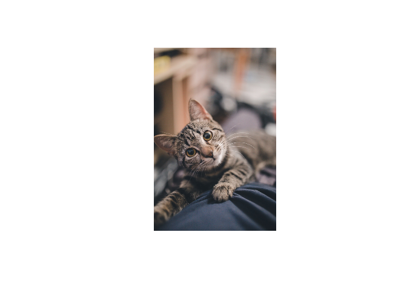
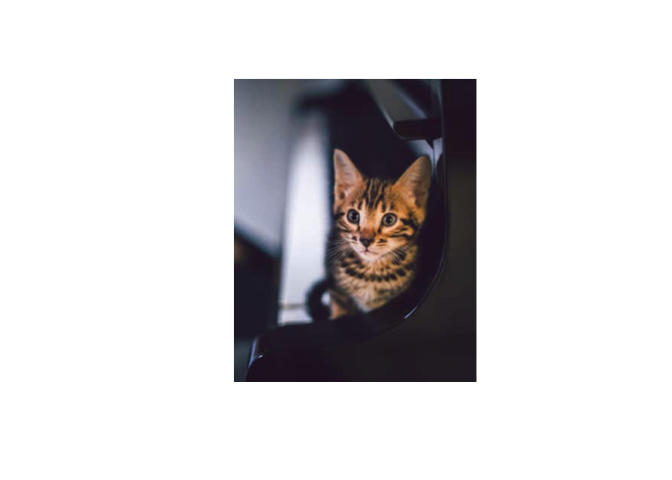

<!-- README.md is generated from README.Rmd. Please edit that file -->

kittyR: Kitty pictures and meows from R console
===============================================

[](https://CRAN.R-project.org/package=kittyR)
[](https://travis-ci.org/IndrajeetPatil/kittyR)
[](https://ci.appveyor.com/project/IndrajeetPatil/kittyR)
[](https://www.tidyverse.org/lifecycle/#experimental)
[](https://www.repostatus.org/#active)
[](/commits/master)
[](https://github.com/IndrajeetPatil/kittyR)

Raison d’être 
==========================================================================

This package is designed for rainy days when your results are
heartbreaking or when no matter what you try, you can’t seem to get rid
of that bug. Take a respite from those negative thoughts by accessing
kitty pics **and** their adorable meows right from your R console 😻 and
then get back to work again!

Installation
============

You can get the development version from [GitHub](https://github.com/)
with:

``` r
# install.packages("remotes")
remotes::install_github("IndrajeetPatil/kittyR")
```

Functions
=========

There are only two available functions in this package-

In case you want a picture of a kitty:

``` r
# to always have the same kitty on README
set.seed(166)

# show me the kitty NOW!
kittyR::kittyR()
```



By default, the collection will include any kind of cat (big, small,
wild, etc.). If you want only kittens, you can use an additional
argument.

``` r
# to always have the same kitty on README
set.seed(122)

# show me the kitten NOW!
kittyR::kittyR(meow = FALSE, only_kitten = TRUE)
```



The collection of cat pictures comes from the following collections of
freely available images:

-   <a href="https://unsplash.com/s/photos/cat/" class="uri">https://unsplash.com/s/photos/cat/</a>
-   <a href="https://www.reshot.com/search/cat/" class="uri">https://www.reshot.com/search/cat/</a>
-   <a href="https://unsplash.com/s/photos/kitten/" class="uri">https://unsplash.com/s/photos/kitten/</a>
-   <a href="https://www.reshot.com/search/kitten/" class="uri">https://www.reshot.com/search/kitten/</a>

In case you just want to hear a meow either *apropos* nothing or at the
end of execution of some code to let you know that the execution is
complete, just include this line of code:

``` r
# can't print the sound, so
# meow meow meow
# you can choose from a sample of sounds included in the package
kittyR::meowR(sound = 4)
```

If you have a kitty meow that you like and would like to include in the
package, please either make a PR or e-mail it to me and I will include
it.

This package was inspired by
[pupR](https://github.com/melissanjohnson/pupR) package by Melissa
Innerst. Thanks are due to my lab buddy Jonathan Phillips for suggesting
including `meowR` function as a replacement for `beepR`.

May these kitties bring some joy and amusement during your stressful
data digging jobs!

Acknowledgments
===============

The hexsticker was generously designed by Sarah Otterstetter (Max Planck
Institute for Human Development, Berlin).

Code of Conduct
===============

Please note that the `tidyBF` project is released with a [Contributor
Code of
Conduct](https://contributor-covenant.org/version/2/0/CODE_OF_CONDUCT.html).
By contributing to this project, you agree to abide by its terms.
